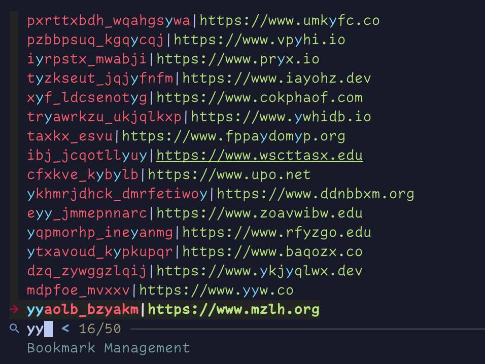

# BM

<h1 align="center">bm 🗺️</h1>

<div align="center">
  <p>
    
    
    
    
    
    
  </p>
 <em>Minimal bookmark management CLI.</em>
</div>



Above command is in my [dotfiles](https://github.com/Allaman/dots/blob/main/dot_local/bin/executable_search-bookmark.sh)

## Why

- For fun
- Very minimalistic
- Platform and browser independent (I run various browser (profiles))

## Add a bookmark

Name must be unique as it is used as primary key.

```sh
bm [--path bookmarks.sqlite] add --url https://www.google.com --name Google [--tags foo bar]
```

(Tags have currently no purpose)

## List bookmarks

```sh
bm [--path bookmarks.sqlite] ls [-s ";" -c]
```

## Delete bookmark

```sh
bm [--path bookmarks.sqlite] del --name Google
```

## Update bookmark

```sh
bm [--path bookmarks.sqlite] upd --url https://www.google2.com --name Google [--tags foo bar]
```

## Search a bookmark

`bm` does not come with a search included. There are better tools out there that can handle this, e.g. [fzf](https://github.com/junegunn/fzf). Above, right under the screenshot I linked the script that calls bm.

This script is mapped to a shortcut in [skhd](https://github.com/koekeishiya/skhd):

```sh
cmd - b : open -n /Applications/Ghostty.app --args --title=bm --command="$HOME/.local/bin/search-bookmark.sh"
```

## Synopsis

```sh
bm --help
Usage: bm <command> [flags]

A minimal bookmarking management CLI

Flags:
  -h, --help                  Show context-sensitive help.
  -p, --path="./bm.sqlite"    Path to the sqlite database

Commands:
  add --url=STRING --name=STRING [flags]
    Add a new bookmark

  del --name=STRING [flags]
    Delete a bookmark

  ls [flags]
    List all bookmarks

  upd --url=STRING --name=STRING [flags]
    Update a bookmark

  version [flags]
    Show version information

Run "bm <command> --help" for more information on a command.

```
